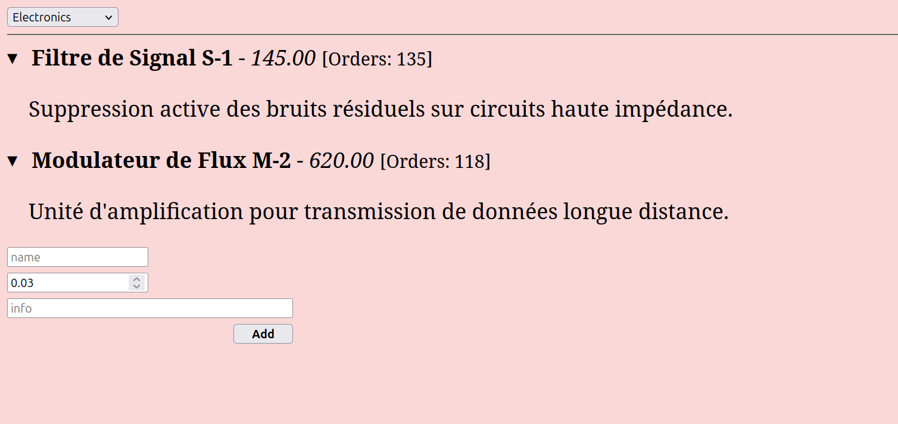
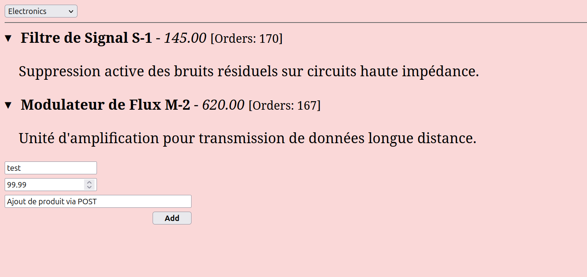
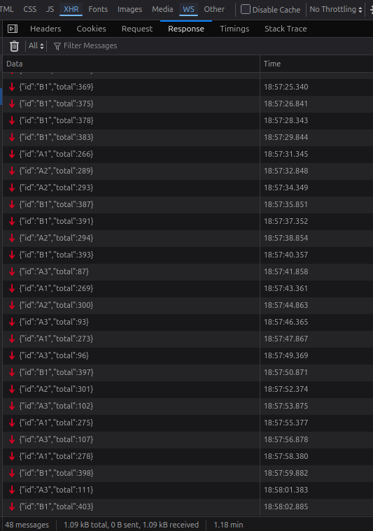
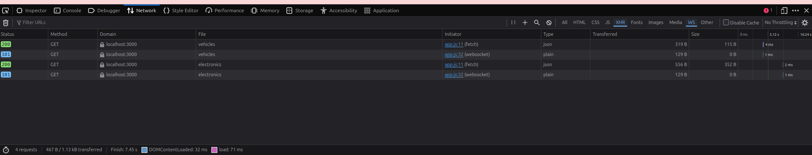
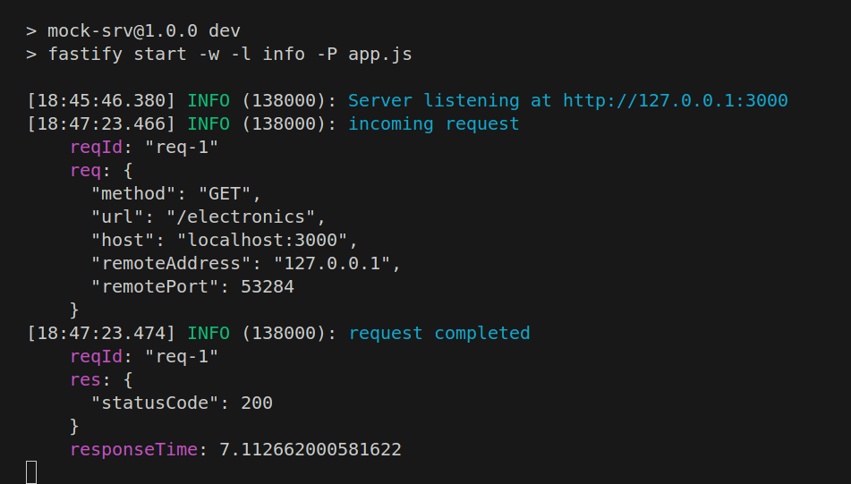
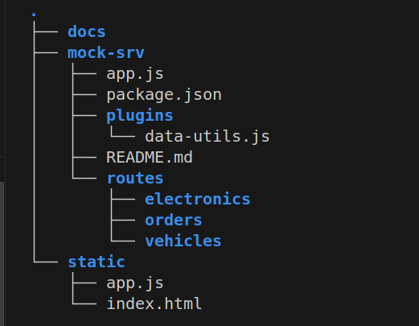

# node-mocking-fastify

TP Node.js : mock d'une petite API produits avec Fastify + WebSockets, et un front en vanilla JS branché dessus.

## Lancer :

```bash
# back
cd mock-srv && npm i && npm run dev

# front (autre terminal)
serve -p 5050 static
```

Puis http://localhost:5050.

## Les screens (ce que ça fait)

### Page de base après avoir choisi une catégorie


On choisit Electronics ou Vehicles dans le `<select>`, le front fait un `fetch` sur `/electronics` ou `/vehicles` et affiche les produits avec un Web Component.

### Ajout d'un produit (POST)


Le formulaire envoie un POST, le serveur génère un id (`A3`, `B2`...) via le plugin `data-utils.js` et renvoie la liste mise à jour.

### Connexions WebSocket dans Network


Les deux lignes en `101 Switching Protocols` = upgrade HTTP → WebSocket vers `/orders/electronics` et `/orders/vehicles`.

### Frames WebSocket en direct


Le serveur push un objet `{id, total}` toutes les 1.5s. Y'a 48 messages reçus sur le screen, on voit bien les totals qui montent.

### Logs Fastify


Pino-pretty qui log la requête entrante (`GET /electronics`) puis `request completed` avec le statusCode et le responseTime.

### Arborescence du projet


Routes auto-loadées par `@fastify/autoload` (un dossier = une route), plugin partagé dans `plugins/`.

## Notes

- mock-srv scaffoldé avec `npm init fastify`
- les données sont en mémoire → restart = reset
- l'order simulator est un async generator (`for await...of`)
